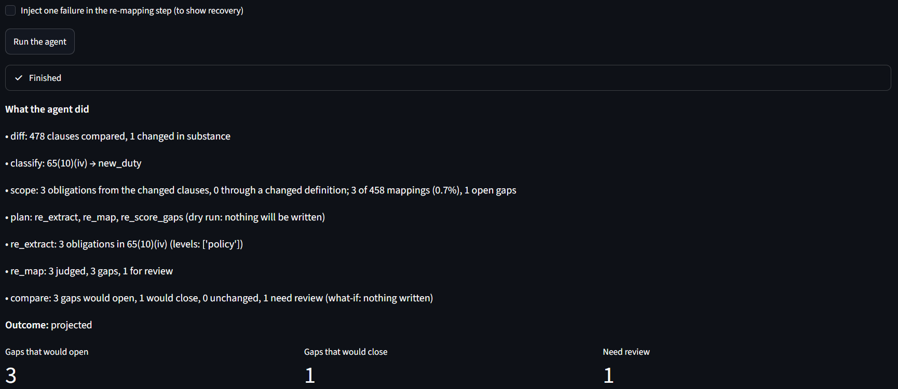
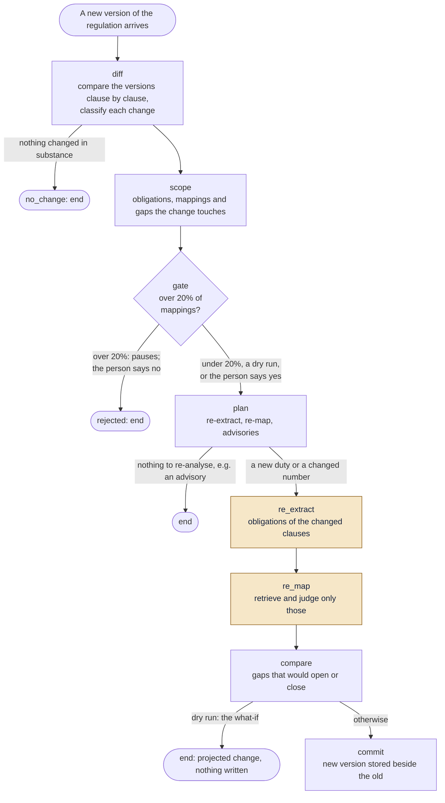

# RegCompliance Agent

Keeps a bank's KYC policy traceable to the regulation it implements: it reads an RBI Direction and
a bank's policy, finds where the policy falls short, shows the evidence for each finding, and when
the regulator amends a rule it re-checks only what the amendment touches.

Built for the **ET AI Hackathon 2026: Agentic Edition (presented by Accenture), Problem 1:
Banking / financial regulations**.

**Live demo:** <https://regcompliance-agent-gg39o3vts7mzhbtds2u6l7.streamlit.app/?scenario=3>
(the free tier sleeps: if the page says the app is asleep, press the button and allow about a
minute)

**In one minute**

- **An RBI amendment re-checked in seconds, not hours.** On RBI's real 29 Dec 2025 amendment the
  agent re-checks only the amended paragraph (3 of 458 mappings) and reports the gaps it would
  open and close: 1 to 22 seconds, against 4 to 8 analyst hours for the same three steps (our
  estimate); a person still reviews the findings and writes the memo.
- **Measured on three banks it had never seen**, with answer keys frozen before the first run:
  weakened numbers found 7 of 7; hidden instructions caught 3 of 3; decoys left alone 7 of 9;
  high-confidence findings real 21 of 28 (Central Bank 8 of 9, Dhanlaxmi 9 of 9, South Indian
  Bank 4 of 10); planted gaps at the right obligation 11 of 20 (at the exact passage 9 of 20).
  Its blind spot: deleted duties (0 of 4).
- **Every finding cited to its source**: the RBI sentence beside the policy sentence, cut from
  the documents by position, so a citation cannot be invented.

Every caveat behind these numbers, one click away: [caveats](docs/EVIDENCE.md#caveats-behind-the-headline-numbers). Every claimed feature,
where to see it in the demo, and what was measured: the [evidence matrix](docs/EVIDENCE.md).

To try it: open the link, go to the **Change agent** tab and press *Run the agent* (the 29 Dec
2025 amendment is preselected); then **Gaps** → row 65(10)(iv) → *Source citation*; then
**Evaluation** → *Banks the system had never seen*.


*A finding with its source: RBI 65(10)(iv) beside the policy passage, three labelled dates, and a
warning that the policy predates the amendment.*



*The change agent on RBI's 29 Dec 2025 amendment (hosted app, dry run): 3 of 458 mappings
re-checked; 3 gaps would open, 1 would close, 1 goes to a person for review.*

## The problem

Regulations → obligations → applicability → internal policies and controls → evidence → testing →
gaps → remediation → ongoing monitoring. A compliance team has to keep that chain intact while
both ends keep changing. Today it is spreadsheet work, redone after every amendment.

## What it does

| Step | How | Who decides |
|---|---|---|
| Read the regulation | A parser splits the RBI Direction into numbered clauses with exact character positions | Code |
| Read the bank policy | Docling layout parsing, then the same clause tree | Code |
| Extract obligations and controls | An open-weights model returns structured items; every quote is sliced from the source by position, so it cannot be invented | Model proposes, code verifies |
| Decide applicability | Each obligation's limiting condition is matched against a bank profile built from the bank's own policy; an obligation is excluded only when the profile states the bank does not offer what the condition names | Code |
| Find policy text for each obligation | Embedding search over extracted controls **and** every raw policy passage | Code |
| Judge coverage | A model gives a verdict and an issue; fixed rules turn that into a gap type | Model judges, code decides |
| Compare the wording | Near-identical sentences are compared directly: numbers, "shall" against "may", inserted conditions | Code |
| Sort into two tiers | High-confidence gaps and a review queue | Code |
| Test controls against evidence | Exception rates from logs against a tolerance | Code |
| Rank by risk | A rubric file: the subject sets the level, the gap type scales it | Code |
| Draft remediation | A model drafts; code sets owner and due date and rejects wording that drops a number or a duty; one remedy per regulation paragraph | Model drafts, code checks |
| Cite the source | Every finding carries the document, paragraph, RBI reference number, issue date, version date, amendment date and link, read from the stored source record | Code |
| Say how sure | A note built from checks code can verify (text comparison, citation, evidence test), with the record of that kind of finding as counts; the model's own confidence number is not shown | Code |
| React to an amendment | A LangGraph agent: diff → classify → scope → re-extract → re-map → compare → commit, with checkpoints and retries; a dry run is the what-if mode (the hosted demo always runs dry; one commit recorded on a copy of the database is shown as version history) | Agent, within fixed rules |
| Monitor | A new evidence batch is tested against the last result (offline it is saved; the demo tests the October batch in memory); a reviewer confirms, dismisses, resolves or accepts | Code and a person |

The system opens gaps. Only a person closes one or accepts a risk.

**The change agent** (LangGraph; node names as in
[`src/regcomp/change/agent.py`](src/regcomp/change/agent.py)):



Shaded nodes call a model; the rest is code. A failed model call in re_extract or re_map is
tried up to three times in all, and state is checkpointed after every node, so a paused or failed run
resumes where it stopped. The hosted demo always runs dry. The agent never closes a gap: only a
reviewer does.

**What the agent decides on its own:** whether anything changed in substance, and the class of
each change; the scope and blast radius; the path (an advisory, or re-extract and re-map);
pausing for a person when a change would re-open more than 20% of mappings; retrying a failed
step and resuming from its checkpoint; and routing an unclear answer to the review queue.

**What it never decides:** whether a gap is real (a person confirms or dismisses it) and closing
a gap. A person starts each run; an RBI watcher that starts it when a circular is published is
on the roadmap.

## Grid position: F3 / D1

Measured against the brief's own definitions.

**F3 needs 8 of the 14 features: 9 are shown on real data.** In the live demo: 1 regulatory
ingestion, 2 change intelligence, 3 obligation extraction, 5 regulation-to-control mapping,
8 gap identification, 9 risk-based prioritisation, 10 remediation recommendations, 11 autonomous
impact analysis, 12 what-if. Partial: 6 control effectiveness and 7 evidence-based assessment
and monitoring (both run in the demo, on synthetic logs for two controls of the development
bank), and 4 control-framework understanding (controls are read from published policy text,
not a control library). Not claimed: 13 cross-regulation intelligence, 14 contradiction
detection.

**Supporting features** (the brief counts them on the same axis):

- *Observability:* every model call is stored with its stage, model, latency and output tokens;
  each run writes its outputs to a run folder; the change agent shows each step as it runs; every
  script says which database it is using.
- *Fault tolerance:* long runs stop at a time budget and resume from the cache; a failed model
  call is retried, a malformed reply gets one repair, and an unusable answer goes to the review
  queue rather than being lost; the agent keeps checkpoints and recovers from an injected failure
  (shown in the demo).
- *Trainability:* reviewer corrections are stored with the old and new verdict as the record to
  re-check the judge against; the confidence note's record is fitted from labelled findings; the
  risk rubric and thresholds are configuration files. No model is fine-tuned.

**D1 (acceptable outputs in a majority of situations)**, on three banks the system had never
seen, frozen v1 (tag `eval-freeze-2026-10-03`), per output type:

- reported outputs acceptable: high-confidence findings real 21 of 28 (Central Bank 8 of 9,
  Dhanlaxmi 9 of 9, South Indian Bank 4 of 10); weakened numbers found 7 of 7; hidden instructions
  caught 3 of 3; decoys left alone 7 of 9; real findings handled 4 of 4;
- planted gaps: a majority raised at the right obligation, 11 of 20 (9 of 20 at the exact passage);
- blind spot, disclosed: deleted duties 0 of 4.

How each figure is scored, and its variants (decoy reachability, first scoring, location-tolerant
rule, labels as first given): [caveats](docs/EVIDENCE.md#caveats-behind-the-headline-numbers).

Not D2: high demonstrable reliability is not shown on omitted duties, and a pre-registered D2
attempt stopped at its own gate (see Limits).

## Results (counts)

Known gaps were planted in public bank policies before any model run, together with decoys that
must not be flagged and one hidden instruction each. The development bank was used to build the
system. Three other banks were each run once, from a clean checkout of the tag
`eval-freeze-2026-10-03`, and nothing was tuned afterwards
([Central Bank](eval/reports/heldout_centralbank_report.md),
[Dhanlaxmi](eval/reports/heldout_dhanlaxmi_report.md),
[South Indian Bank](eval/reports/heldout_southindianbank_report.md), run on 3 Oct).

**Proven on three banks the system had never seen** (each run once, counts):

- every weakened number and stale threshold was found: **7 of 7**, all in the high-confidence
  tier (4 of 7 with the right gap type);
- hidden instructions in the policy: **3 of 3** caught;
- real findings in the published policies: **4 of 4** handled correctly;
- decoys (rewordings and stricter numbers) left alone: **7 of 9** ([caveats](docs/EVIDENCE.md#caveats-behind-the-headline-numbers));
- change detection against RBI's own amendment markers: **2 of 2** on the KYC Direction and
  **262 of 266** amended clauses on nine other Directions.

**Not yet, the next milestone:** deleted duties 0 of 4, narrowed scope 1 of 4, contradictions
0 of 2 (one found at the right obligation), a removed owner 0 of 1, a duty made optional 1 of 2
(the other found at the right obligation). Overall: 9 of 20 planted gaps at the exact passage,
11 of 20 at the right obligation. Claim: **F3 / D1** ([grid position](#grid-position-f3--d1)).

| Measure | Development bank | Central Bank (unseen) | Dhanlaxmi (unseen) | South Indian Bank (unseen) |
|---|---|---|---|---|
| Planted gaps found at the exact passage | 5 of 7 | 3 of 7 | 2 of 6 | 4 of 7 |
| ...of which in the high-confidence tier | 3 | 3 | 2 | 2 |
| Planted gaps found at the right obligation | 6 of 7 | 4 of 7 | 3 of 6 | 4 of 7 |
| Decoys flagged: high-confidence / review | 0 / 1 of 3 | 1 / 0 of 3 | 0 / 0 of 3 (unreachable) | 0 / 1 of 3 |
| Hidden instruction flagged | 1 of 1 | 1 of 1 | 1 of 1 | 1 of 1 |
| Other reports: high-confidence + review | 17 + 38 | 15 + 36 | 42 + 43 | 12 + 29 |
| Applicability: obligations excluded | 0 of 458 | 0 of 458 | 0 of 458 | 0 of 458 |

**Precision of the high-confidence tier on the unseen banks** (measured after the freeze, not
tuned on): a blind sample of 10 high-confidence findings per bank, mixed with 10 pairs the system
judged covered, no verdict shown, seed committed first. The author labelled them (an AI model,
Gemini, helped write the reasons); every "gap" label was then checked against the whole policy.

| | Central Bank | Dhanlaxmi | South Indian Bank |
|---|---|---|---|
| Sampled findings that are real gaps (of those decided) | 8 of 9 | 9 of 9 | 4 of 10 |
| ...counting duties only (leaving out reliefs the policy has not adopted) | 6 of 7 | 8 of 8 | 4 of 10 |
| Unsure | 1 | 1 | 0 |
| Sampled covered pairs that really are covered | 8 of 10 (one miss is planted gap C05) | 9 of 10 | 9 of 10 (the miss is planted gap S01) |
| Control-extraction coverage of the policy text | about 62% | about 8% | not measured this way; text inside extraction units: 134,634 of 165,629 characters (code only) |

South Indian Bank's sheet holds every high-confidence finding outside the key: 12 findings,
forming 10 distinct regulation-passage pairs, all 10 on the blind sheet. The full-policy check
set aside 3 of its 7 "gap" labels: in two the policy (approved March 2026) states the duty in
another passage, for example "Reason(s) of rejection shall be duly recorded by the officer
concerned"; one (RBI 65(5), which binds lenders other than scheduled commercial banks) does not
apply to the bank and counts as a false positive. On the third bank most high-confidence findings were duties the policy states in a different passage from the one the system compared, so its high-confidence tier was weak there. On the two older policies the
tier was mostly real gaps. A "gap" label is set aside only when another passage carries the whole duty: same subject and scope, mandatory, same or stricter (the three-part test, applied to all three banks). Two first-pass set-asides on this bank and two on
covered pairs of the other banks failed it and were reversed
([report](eval/reports/heldout_precision/report.md)). Precision per bank: 8 of 9, 9 of 9, 4 of
10 (21 of 28 overall).

Most of these real gaps are provisions the 2024 policies predate (for example the December 2025
CKYCR responsibility and the advance-intimation rules). The samples are small (10 of 14 and 10 of
41 distinct findings), so these are counts, not rates. On the development bank, whose policy is
more recent, the same tier did worse: of 14 findings checked, 3 real, 7 false alarms, 4 unclear.

On Dhanlaxmi, control extraction
covered only about 8% of the policy text (its clauses are numbered 4.1.2-style): the judge still
compared every passage, but extraction-based checks saw little of it. That was found after the
freeze and is not fixed. Evidence tests: 2 of 2 on the development bank.

**A second answer key on the same bank** (4 planted gaps, 3 decoys, 1 injection, on passages picked by a seeded draw and written after the comparison rules) checks whether those rules hold on gaps they were not written for. Result: 3 of 4 planted gaps found, all three in the review queue and none in the high-confidence tier; the contradiction was missed; the stricter-number decoy was flagged in the review queue; the injected instruction was not flagged (0 of 1). Two causes were fixed afterwards, from the general principle and before the freeze: the number comparison ignored the number one ("one year" against "two years"), and instruction detection depended on the extraction model noticing the text; a code-level scan now checks every sentence. With both fixes the first key's results are unchanged, and the second key reads 3 of 4 found (1 high-confidence) and the injection flagged. That second reading is not a test, because the fixes were made knowing its misses.

Read these with two cautions. The wording-comparison rules were written after studying this bank's
misses, so they fit it well. And the high-confidence extras are mostly false alarms: of 14
high-confidence findings that nothing else had settled, the author's check (helped by an AI model,
with every "gap" label verified against the full policy) found 3 real gaps, 7 false alarms and 4 unclear
([error analysis](eval/reports/error_analysis_e2e11.md)). The three banks the system had never
seen were each scored once, at the freeze, with answer keys committed before any model read those
policies (results above).

## Business impact (measured time, estimated baseline)

Change agent, dry run, per circular, first run included
([timing](eval/reports/change_agent_timing.json)): with the hosted open-weights model (what the
demo uses) 1.1 to 22 s; with local qwen3:8b on one laptop GPU (RTX 4060) 1.7 to 81 s. The low end
is a permissive amendment, which needs no model call; the high end is a circular with one new duty
on a first, uncached run (17 s locally once cached). Baseline: 4 to 8 analyst hours for the
same three steps (our estimate, not a measurement; table below); a person still reviews the
findings and writes the memo. One caution: on the December 2025 amendment the local 8B
model extracted no obligations from the amended paragraph, so that run is not counted; the hosted
model extracted three.

Where an analyst's time goes, per circular and per bank policy (our estimate, not measured), and
what the agent does in each step. The agent does the first three, 4 to 8 hours in all; the memo
stays with a person:

| Step | Analyst (our estimate) | The agent (measured on RBI's two real amendments) |
|---|---|---|
| Read the circular, find what changed | 1 to 2 h | compares the versions clause by clause: 1 substantive change in Dec 2025, where a plain line comparison reports 507 |
| Find the affected obligations and policy clauses | 1 to 2 h | scope: 3 of 458 mappings; the other 455 are left alone |
| Check each affected policy passage | 2 to 4 h | re-extracts and re-judges only those: 3 obligations in Dec 2025; none in Sep 2026 (a permission, reported as an advisory) |
| Write the memo: findings, citations, remedies | 1 to 2 h | not done by the agent: its findings arrive cited, and a person reviews them and writes the memo (not timed) |

Cost per bank per amendment. Measured: RBI's two real amendments took 0 and 3 model calls. For
scale, adding a whole new bank policy took 405 calls (about 50 model-minutes on one laptop GPU),
with the regulation side reused from the cache
([report](eval/reports/heldout_southindianbank_report.md)). An amendment that rewrote most of the
Direction would also need the regulation side re-extracted; we have not measured that case. The
hosted demo runs on a free tier, so its bill was Rs 0; we have not priced a paid deployment.

How often: RBI's page for the previous KYC Master Direction (2016) lists 16 update dates between
29 May 2019 and 14 Aug 2025
([RBI, Master Directions](https://www.rbi.org.in/Scripts/BS_ViewMasDirections.aspx?id=11566)); the
2025 Directions that replaced it were amended twice in their first ten months. Each update means
the steps above again, for every policy that implements the Direction.

## Data (all public or synthetic)

- **Regulation:** RBI (Commercial Banks – Know Your Customer) Directions, 2025, in three real
  versions (28 Nov 2025, and after the amendments of 29 Dec 2025 and 18 Sep 2026), plus nine other
  RBI Directions used only to test change detection.
- **Bank policies:** the published KYC/AML policies of Nainital Bank (development), Central Bank
  of India, Dhanlaxmi Bank and South Indian Bank (all three held out).
- **Evidence:** synthetic logs with identifiers only.
- **A synthetic draft circular** for the what-if demo: one invented sentence added to the current
  Direction, clearly marked.
- Provenance, source URLs and sha256 for every file: [`data/sources.yaml`](data/sources.yaml).
  Raw files are stored byte-identical so citation positions stay valid.

## Run it

**To see results with no setup, use the [live demo](https://regcompliance-agent-gg39o3vts7mzhbtds2u6l7.streamlit.app/?scenario=3).**
A fresh local database is empty: the app shows results only after the full pipeline below has
run, which takes about an hour on one laptop GPU.

Prerequisites: Python 3.13 and [uv](https://docs.astral.sh/uv/); Docker for a local database;
[Ollama](https://ollama.com) and a GPU only for the offline full pipeline.

```bash
uv sync                         # core
uv sync --extra pdf             # adds Docling for PDF parsing (large)
uv run pytest                   # 159 tests, no database needed
cp .env.example .env            # already points at the compose database below
docker compose up -d            # Postgres 18 + pgvector; db/schema.sql loads on first start
uv run python scripts/db_init.py  # applies the migrations (safe to re-run)
ollama pull qwen3:8b            # local models, for the offline pipeline only
ollama pull bge-m3
```

The pipeline, on the development bank (needs Postgres with pgvector, and Ollama with `qwen3:8b`
and `bge-m3`; copy `.env.example` to `.env`):

```bash
uv run python scripts/run_extract.py --run demo            # obligations and controls
uv run python scripts/run_level.py --run demo              # obligation level
uv run python scripts/run_map.py --run demo --passages --dense-only --stop-after-min 25
uv run python scripts/load_metadata.py                     # source metadata for citations
uv run python scripts/run_tests.py                         # design and operating tests
uv run python scripts/run_verify.py                        # wording comparison and tiers
uv run python scripts/run_applicability.py --apply         # applicability by bank profile
uv run python scripts/run_risk.py                          # risk ranking
uv run python scripts/run_remediation.py --top 100         # drafts for every high-confidence gap
uv run python scripts/clean_remediation.py --apply         # one remedy per paragraph
uv run python scripts/score.py --run demo                  # against the answer key
```

Every model call is cached, so a stopped run resumes where it left off and a repeated run is
free. The change agent and the app:

```bash
uv run python scripts/run_change.py --old data/raw/rbi/kycdir_v2_20251229.html \
    --new data/raw/rbi/kycdir_v3_20260918.html --dry-run
uv run python scripts/run_evidence.py                      # a new evidence batch arrives
uv run python scripts/review.py                            # the review queue
uv run streamlit run app/streamlit_app.py
```

Any stage can be moved to a hosted open-weights model with one setting, for example
`REGCOMP_MODEL=groq:openai/gpt-oss-120b`. The deployed app runs that way, because it has no GPU.

## Layout

```
src/regcomp/ingest/     parsing: RBI HTML, Docling PDFs, clause tree
src/regcomp/pipeline/   extraction, citation gate, judge and gap rules, passages, wording comparison
src/regcomp/change/     clause diff, change classification, scope, the agent, versioned writes
src/regcomp/            evidence tests, monitoring, risk rubric, remediation, reviewer decisions, LLM access
scripts/                one script per pipeline stage, the evaluation tools
app/                    the Streamlit demo
db/                     Postgres + pgvector schema and migrations (versioned rows, nothing deleted)
data/                   public sources, planted-gap specifications, rubric and triage settings
eval/                   answer keys and published reports
docs/                   architecture, plan, how the test sets were built, decision records
```

## Safeguards

- **Citations cannot be invented.** The model names where a sentence starts; code cuts the quote
  from the source.
- **Numbers and duties must survive.** Wording comparison and remediation drafts check that every
  number and every "shall / shall not" is kept.
- **Instruction-like text in a document is treated as data, never followed.** It is flagged by the
  extraction model (1 of 2 on the development keys) and by a code-level scan that needs no model
  (0 false flags on the unaltered development policy).
- **Dates and references come from the source record.** A citation's fields are read from the
  stored document data and RBI's own amendment markers, never from a model.
- **Two tiers.** Anything the comparison contradicts, anything procedure-level and anything
  technical goes to a review queue instead of being asserted or silently dropped.
- **Read-only what-if.** A dry run has no path to the step that writes; a large change pauses for
  a person.
- **Evidence stays in code.** The model never sees evidence rows, only counts.
- **Bias.** No personal data is processed (public regulations, public bank policies, synthetic
  evidence logs with identifiers only), so there are no customers or groups to treat unequally.
  The bias we measured is the model's lean towards "covered": most misses on the unseen banks are
  false "covered" verdicts (all four deleted duties, a scope narrowed to "savings accounts", a
  limit stated in a list lead-in). Doubtful findings go to a review queue, and only a person closes
  or accepts a gap, with a name and a reason.

Not enforced by code: the rule that only public or synthetic data reaches a model is a working
rule of this project, and there is no per-event spending cap.

## Limits

- Gap detection is measured on small sets (7 planted gaps per bank); results are counts, not
  statistics.
- The comparison rules were written after studying development misses.
- "Policy-level or procedure-level" is a convention: two independent labellers agreed on 30 of 50
  rows. The system routes such items to review rather than deciding.
- **Input scope.** One regulation end to end (the RBI KYC Directions, HTML and PDF); published
  bank KYC/AML policies (PDF); text input only. No control libraries, SOPs, RCSA registers or
  test records. No upload in the hosted app: a new policy runs offline on the local GPU (on the
  third bank, 405 new model calls and about 50 model-minutes on one laptop GPU, the regulation
  side coming from the cache). A person chooses which policy is checked
  against which Direction.
- **The demo never writes.** The change agent runs dry in the hosted app; the commit step (a new
  version stored beside the old, old rows closed in time) is tested offline, and one commit of the change agent and two reviewer decisions, recorded on a copy of the database (d2, development data), are shown read-only
  (Change agent: version history; Review queue: decision trail). The new evidence batch is tested
  in memory. Evidence is synthetic (identifiers only) and covers two controls of the development
  bank.
- A bank profile lists what the bank's policy mentions. A policy that restates the regulation mentions almost everything, so the applicability step excluded nothing on the banks tested, and no precision gain is claimed from it. The what-if in the app is hypothetical: it shows what would drop out if a bank stated it did not offer something. A profile built from independent facts is on the roadmap.
- The hosted demo depends on free tiers (a daily token cap for the hosted model).
- **Tried and stopped: D2.** A pre-registered attempt ([bar](eval/d2_bar.md)) stopped at its own
  gate on development data: 1 of 4 target misses found, and the new-finding ceiling broken on all
  three banks (local qwen3:8b). A code rule caught a deleted duty without a model; judging scope
  needs a stronger model. Unmerged branch `d2`,
  [closing note](https://github.com/ashashkaWestfeild/regcompliance-agent/blob/d2/eval/reports/d2_closing_note.md).
- **Review of 7 Oct, on the roadmap:** what the planted keys measure (sensitivity to known
  edits, not real-world recall), one labeller for the precision sheets, the hosted demo's model
  differs from the evaluated one, deleted duties need an obligation-side element check, model
  digests pinned, the injection scan as a second line of defence, and a least-privilege database
  role for the app ([details](docs/ARCHITECTURE.md#9-limits-and-what-comes-next)).
- **Started, not claimed: conflicts inside one policy.** A code-only check flags two passages of
  one policy that restate the same RBI sentence with different numbers or periods. On the
  development keys it found the 3 planted numeric contradictions with no other flag, but its
  rules were written on those keys, so this is a best case
  ([report](eval/reports/policy_conflicts_dev.md), development data). Not in the app or the gap
  table; feature 14 stays not claimed. Next: conflicts in wording, and between regulations.

More detail: [`docs/ARCHITECTURE.md`](docs/ARCHITECTURE.md),
[`docs/mutation_taxonomy.md`](docs/mutation_taxonomy.md), [`docs/adr/`](docs/adr/).

## AI assistance disclosure

Most of the code was written with **Claude Code** (Anthropic) as a coding assistant, under the
author's direction; the author made the scope, data and evaluation decisions and reviewed the
planted-gap answer keys. The 50-pair check sheet was labelled blind by two AI models (Claude and
Gemini) and the author decided the disputed rows. On the later high-confidence and held-out
precision sheets the author decided the labels, with Gemini helping to write the reasons. The
system itself runs on open-weights models.

## Acknowledgements

Some patterns (Docling parsing, retry with fallback, LangGraph Postgres checkpointing) were
informed by the Krish Naik YouTube channel. No code was copied.

## Licence

[Apache-2.0](LICENSE)
