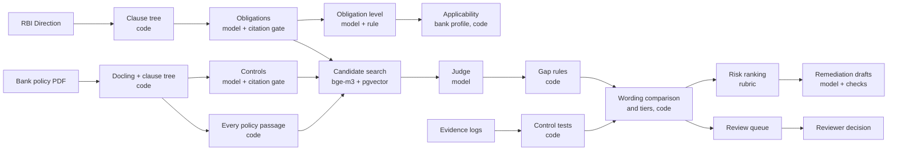
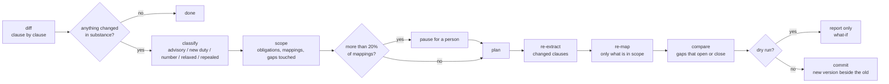

# Architecture

RegCompliance Agent checks a bank's KYC policy against an RBI Direction and keeps that check
current when the Direction is amended. This document describes how it is built, what decides
what, how it is evaluated, and where it falls short.

## 1. Principle: the model reads, code decides

A small open-weights model is good at reading a clause and saying what it requires. It is not
reliable at copying text exactly, comparing two numbers, or being consistent. So every step is
split:

| The model does | Code does |
|---|---|
| Extract obligations and controls as structured items | Cut every quote from the source by position; reject an item whose quote is not found; collapse repeats |
| Give a verdict and name an issue | Turn verdict + issue into a gap type by fixed rules |
| (not asked) | Compare near-identical sentences: numbers, "shall" against "may", inserted conditions |
| Draft a remediation | Set owner and due date; reject wording that drops a number or a duty |
| (never sees evidence rows) | Compute exception rates and test them against a tolerance |
| (not asked) | Rank risk from a rubric file |
| (not asked) | Decide whether an obligation applies to the bank, against a profile built from the bank's own policy |

Decision records: [`adr/`](adr/).

## 2. Process flow

Everything is stored in Postgres with pgvector. Rows are versioned: a change adds a new row and
closes the old one in time; nothing is deleted.

### Stages

| # | Stage | Detail |
|---|---|---|
| 1 | Parse | The regulation and the policy become trees of numbered clauses with exact character spans. No fixed-size chunks. |
| 2 | Extract | Obligations (actor, modality, action, threshold) and controls. The model returns the first words of the sentence; code locates them and cuts the sentence. Definitions are extracted clause by clause. A citation at a lead-in ("the bank shall:") moves to the list item that states the duty. |
| 3 | Level | Each obligation is marked policy-level, procedure/system-level or not applicable. A quantified requirement is always policy-level. |
| 3b | Applicability | Each obligation's limiting condition is matched against a bank profile ([`applicability.py`](../src/regcomp/applicability.py)). The profile is built by code from the bank's published policy: a product, channel, customer segment or geography is listed when the policy deals with it, with the clause as evidence. Applies: the bank has every attribute the condition names, or the condition names none. Does not apply: only when the profile states, with a source, that the bank does not offer what the condition names; the gap then leaves both tiers and stays visible with the reason. To confirm: the profile is silent; this is a note on the finding and moves nothing. Each decision is stored with its reason, the attribute relied on and who decided. A model fallback exists but is off: two models marked ordinary conditions (customer risk grades, for example) as bank attributes. |
| 4 | Candidates | For each obligation, the closest policy text by embedding, over extracted controls and every raw policy passage (control extraction misses text, so it is not the only source). Repeats of the same text are dropped; the top five go to the judge. A cross-encoder reranker was removed after it lowered the share of cases where the right passage was in the top five. |
| 5 | Judge | One call per regulation unit. Verdict (covered, partial, missing) and an issue from a fixed list. Fixed rules map these to a gap type. |
| 6 | Tests | Design: does the control name an owner, a frequency, evidence. Operating: exception rate in an evidence log against a tolerance. |
| 7 | Wording comparison and tiers | See section 3. |
| 8 | Risk | [`data/risk_rubric.yaml`](../data/risk_rubric.yaml): the subject of the obligation sets the inherent level; the gap type scales it. |
| 9 | Remediation | Drafted for the top high-confidence gaps; a draft that fails the fidelity check is replaced by the regulation's own sentence. One remedy is kept per regulation paragraph, and prompt tags never reach the reader. |
| 10 | Citation | Every finding shows the document, paragraph, RBI reference number, link and three separately labelled dates: first issued, version in force ("updated as on"), and, where RBI marks the paragraph, the amendment and its effective date. The bank side shows the policy title, section and the policy's own stated date, and flags a policy dated before the amendment to the cited paragraph. All fields come from [`data/sources.yaml`](../data/sources.yaml) and the parser ([`citation.py`](../src/regcomp/citation.py)); a test checks them against the source record. |

## 3. Wording comparison and the two tiers

Bank policies restate much of the regulation almost word for word. Where that is so, code compares
the two sentences directly ([`pipeline/verify.py`](../src/regcomp/pipeline/verify.py)):

- **Number sweep.** Every regulation sentence that states a number is lined up with its closest
  policy sentence. A number the policy sentence lacks becomes a gap at that passage, even if no
  obligation was extracted from the sentence.
- **Weaker or stricter.** Decided by the words before the number: after "more than", "within",
  "once in every" a larger policy number is weaker; after "at least" a smaller one is. A model is
  asked only when the wording does not decide.
- **Force.** A mandatory obligation whose matching policy sentence says "may".
- **Inserted limits.** A limiting phrase ("only", "at the time of", "in case of") that the policy
  sentence adds inside otherwise matching text.

The result is two tiers:

| High-confidence | Review queue |
|---|---|
| A judge gap the comparison does not contradict | A judge gap where the policy states the text near verbatim |
| A changed number where the policy is weaker | A changed number where the policy is stricter or the direction is unclear |
| | An obligation judged covered whose policy sentence adds a limit or says "may" |
| | A gap on a procedure-level obligation (shown, not dropped) |
| | A gap on a technical system requirement ([`data/triage.yaml`](../data/triage.yaml)) |
| | A control whose latest evidence has recovered |

The comparison sorts findings; it never deletes one.

## 4. The change agent

The one agentic component (LangGraph). A new version of the regulation arrives:

- **An added option is an advisory, not a gap.** The 18 Sep 2026 amendment lets banks use a
  certified-copy route for one more customer type; it is permissive ("may"). The agent reports
  "policy update recommended" and re-maps nothing.
- **Scope.** Obligations taken from the changed clause, and obligations that use a changed
  definition. On the real amendments this is 3 of 458 mappings.
- **Recovery.** A failed model step is retried by the graph; a unit with no answer goes to
  review. State is checkpointed in Postgres after every step, so a paused or crashed run resumes.
- **What-if.** The dry run ends after "compare". It has no path to the step that writes.

A second trigger needs no agent: a new batch of operating evidence is tested and compared with
the control's previous result (newly failing, still failing, recovered, healthy).

## 5. Models

| Use | Model | Where |
|---|---|---|
| Extraction, level, judge, remediation | `qwen3:8b` (open weights) | Ollama on a laptop GPU (8 GB) |
| Embeddings | `bge-m3` | Ollama |
| Live model steps in the deployed app | `openai/gpt-oss-120b` (open weights) | Groq free plan |

Models are chosen per stage by configuration. Every call is cached by an exact hash of stage,
model, prompt, schema and options; there is no semantic cache, because two clauses that differ
only in "10 days" and "30 days" must not share an answer. Prompts name no clause, threshold or
theme from any answer key.

A 120B hosted model was compared with the local judge on 56 development units with identical
prompts: the same number of gaps, 37 in common, better gap types, one more decoy flagged. It was
not adopted as the evaluated judge ([data](../eval/reports/judge_compare.json)).

## 6. Evaluation

### Design

- **Planted gaps.** Known errors are written into public bank policies as exact find/replace edits:
  a deleted duty, a weakened or stale number, a narrowed scope, a contradiction, a duty made
  optional, a removed owner. Decoys (rewording, reordering, a stricter number) must not be
  flagged. One injected instruction per policy must be flagged and must change nothing.
  Details: [`mutation_taxonomy.md`](mutation_taxonomy.md).
- **Keys before runs.** Each answer key is committed before any model reads that policy; the
  commit time is the evidence.
- **Splits.** Nainital Bank is the development set. Central Bank of India and Dhanlaxmi Bank are
  held out and run once, at the freeze. For the third bank the passages were chosen by a seeded
  draw committed in advance, because its key was written after development results were known.
- **Strict matching.** A planted gap counts as found only if the report is at the right
  obligation and cites the altered passage. The count at the right obligation with any passage is
  reported beside it.
- **Counts, not percentages.** The sets are small.
- **Change detection** is scored against RBI's own amendment markers.

### Development results

| Measure | Result |
|---|---|
| Planted gaps, exact passage | 5 of 7 (3 high-confidence, 2 review) |
| Planted gaps, right obligation | 6 of 7 |
| Decoys flagged | 0 of 3 high-confidence, 1 of 3 review |
| Other reports | 17 high-confidence, 38 review |
| Injection caught / real findings / evidence tests | 1 of 1 / 2 of 2 / 2 of 2 |
| Change detection | 2 of 2 KYC amendments; 262 of 266 clauses in nine other Directions |
| Applicability | 458 of 458 obligations apply to the development bank; none excluded, none to confirm |

Still missed on development: the removed owner, and the contradiction is flagged at the right
obligation with the wrong passage.

Held-out results: to be added at the freeze.

### Confidence

The judge returns a number from 0 to 1 with each verdict. It is stored and not shown. Measured on
the development bank against the answer key and the 50 adjudicated pairs
([table](../eval/reports/confidence_table.json)):

| Judge's number | Verdicts | With a known answer | Right |
|---|---|---|---|
| 1.00 | 269 | 27 | 25 |
| 0.95 to 0.99 | 118 | 15 | 13 |
| 0.80 to 0.94 | 54 | 7 | 4 |
| below 0.80 | 17 | 3 | 1 |

The number mostly restates the verdict: every checked verdict at 1.00 was "covered", nearly every
one below 0.95 was a gap, and two planted gaps were passed as covered at 1.00. The prompt asks for
"confidence between 0 and 1" without saying confidence in what. It is left as it is, because
rewording it means judging every obligation again.

Each finding instead carries a note built from checks that code can verify
([`confidence.py`](../src/regcomp/confidence.py)): an evidence test failed; the judge and the text
comparison agree; the text comparison found a difference the judge had passed; the judge alone;
the judge contradicted by near-verbatim policy text; and whether the policy citation was verified.
Each combination shows its record on the development bank as counts. Two cautions: most findings
of each kind are not adjudicated (16 of the 21 "judge alone" findings, for example), and most of
the adjudicated ones are gaps we planted, which are real by construction. The records are
therefore not hit rates. The table is fitted on the development bank only and frozen before the
held-out runs, which are then reported against it.

### Integrity disclosures

- **Same toolchain.** The answer keys were authored with the same AI coding assistant that helped
  build the system. Mitigations: edits are hand-written and applied by a script; every item was
  reviewed by the author; a redundancy check (lexical and semantic) confirmed that no other
  passage still satisfies each altered obligation; keys were committed before any run; prompts
  are generic.
- **Rules written after development misses.** The wording comparison was designed on 2 Oct after
  studying which planted gaps the development run missed. Development numbers therefore flatter
  it; the held-out banks are the test.
- **Labels.** A blind sheet of 50 obligation and passage pairs was labelled by two AI models
  independently (36 of 50 agree on whether the passage satisfies the requirement) and the author
  decided the disputed rows. Checking each "gap" against the full policy text showed 12 of 15
  were covered elsewhere: the judge had not been shown the right text. That finding led to
  offering every policy passage as a candidate.
- **Obligation level is a convention.** The two labellers agree on 30 of 50 rows about what is
  policy-level. Level therefore routes items to review and is not reported as an accuracy figure.
- **Correlated error.** The redundancy check and the pipeline both use bge-m3; a passage both
  miss would make a planted gap look valid. Lexical search and manual reading reduce this.
- **Bank profiles.** The profiles of all three banks are built by a script from the published policies and were committed (`c286fd7`) before any held-out run; no model read the held-out policies. The vocabulary behind them was written from the regulation's own conditions. A profile lists what a policy mentions, which is weaker than what the bank offers: a policy that restates the regulation mentions almost everything, so on the development bank the stage excludes nothing.
- **Real findings** in the published policies are labelled separately and scored by their own
  rules, never as false alarms. A real gap that shares an obligation with a planted one counts
  neither way.

## 7. Safeguards

| Risk | Safeguard | Status |
|---|---|---|
| Invented citations | Quotes are cut from the source by position | Built |
| Changed numbers or lost duties | Wording comparison; fidelity check on remediation drafts | Built |
| Instructions hidden in a document | Flagged with the verbatim text; documents are passed as data | Built |
| Over-confident output | Two tiers and a review queue | Built |
| An agent that writes too much | Dry run cannot reach the write step; pause above 20% of mappings; versioned writes, nothing deleted | Built |
| Machine closes a gap | Only a reviewer confirms, dismisses, resolves or accepts; name and reason recorded | Built |
| Evidence leaking to a model | Tests run in code; the model sees no rows | Built |
| Private data reaching a model | Only public or synthetic data is used | A working rule, not enforced by code |
| Runaway cost | Exact-match cache; time budget per run | No per-event spending cap |

## 8. Deployment

- **Pipeline:** local (Ollama, Postgres 18 + pgvector on Neon). Long runs stop at a time budget
  and resume from the cache. `docker-compose.yml` starts a local database with the schema.
- **Demo:** Streamlit Community Cloud, reading the same database. It has no GPU: model steps use
  the hosted model, and candidate search falls back from embeddings to shared wording. A visitor
  cannot change data; a reviewer decision is saved only with a reviewer code.
- **In a bank:** the same components inside the bank's network: Postgres, an internal model
  server, the policy and evidence never leaving it.

## 9. Limits and what comes next

- Detection is measured on 7 planted gaps per bank. About 11 of the 17 high-confidence extras on
  the development bank are false alarms, mostly passages that restate an obligation with a
  different sentence structure.
- A removed owner is not detected on plain policy passages.
- One regulation end to end; nine others only for change detection. Text input only.
- No cross-regulation analysis and no detection of contradictions between regulations.
- No document routing: a person chooses which policy is checked against which Direction.
- Next: a design check for owners the regulation itself names; a wider comparison for reworded
  sentences; more than one development bank.

## 10. Claim

Functional scope: ingestion, change intelligence, obligation extraction, control understanding,
mapping, gap identification, risk ranking and impact analysis, with remediation, evidence testing
and what-if as built extras. Depth: structured and text input with measured reliability on the
development bank; the level claimed is decided from the held-out results at the freeze.
